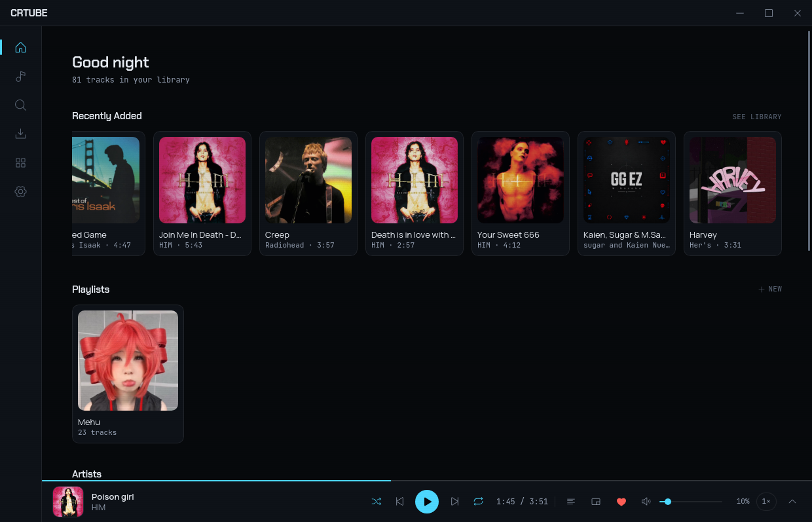

# CRTube

<p align="center">
  
</p>

<p align="center">
  <a href="https://github.com/SlyHammad18/CRTube/releases/latest"></a>
  
  
  
  
  
  
</p>

A desktop client for downloading YouTube videos and audio, built on
[Tauri v2](https://v2.tauri.app/) + React + Rust. Search, pick a format, and
queue downloads with live progress — everything runs locally through
[yt-dlp](https://github.com/yt-dlp/yt-dlp) and ffmpeg, with no telemetry.

## Features

- **Search & instant formats** — search YouTube or paste a link; the format
  sheet shows real probed resolutions, codecs, and size estimates.
- **Audio + video** — download as MP4 / WebM / MKV, or extract MP3 with
  embedded cover art and tags.
- **Live queue** — concurrent downloads with real-time progress, speed, and
  ETA readouts, cancel, and a library that persists across restarts.
- **Self-updating engine** — yt-dlp is kept current via atomic, checksummed
  GitHub releases; ffmpeg is installed once. Updates never call `yt-dlp -U`.
- **Resilient** — friendly messages for offline boots, region-blocked videos,
  disk-full, rate limits, and bad links. Never crashes on a tool error.
- **Ice Console design** — dark-only, cool-neutral palette with a single ice
  accent, monospaced numerics, and motion that collapses under
  `prefers-reduced-motion`.

## What's new in v0.2.0

v0.2.0 is a major update built around **in-app playback** — downloaded audio and
video now play directly inside CRTube, alongside a full library, playlist, and
lyrics experience. Highlights since v0.1.0:

- **Music player** — a global player bar with play/pause, seek, volume (with an
  on-screen percentage) and mute, plus playback-speed control. Audio and video
  stream through a local loopback media server, so files never leave your machine.
- **Video playback** — watch downloaded videos in a stable in-app surface with
  fullscreen (including 1080p). Codecs WebKitGTK can't decode are transparently
  re-encoded on the fly at playback time.
- **Library & track lists** — All Tracks / Recently Added views, single-click to
  play, filter by Audio/Video, and sort controls.
- **Playlists** — create, rename, and drag-to-reorder playlists; add tracks via a
  portaled popover and remove them with a confirm modal. Three-phase repeat:
  off → loop playlist → loop one.
- **Now Playing** — a dedicated pane with artwork, a caption deck, and track
  metadata; the global bar auto-hides while Now Playing is open.
- **Up Next** — a sidebar queue of upcoming tracks.
- **Lyrics** — synced, scrollable lyrics from the LRCLIB service, a "jump to
  current line" sync button, and a fullscreen lyrics overlay. Urdu/Nastaliq lines
  render in Noto Nastaliq Urdu (right-aligned) for proper script support.
- **Polish** — toast alerts moved to the top-right, delete confirmations, and a
  refreshed app icon (device mark) across all platforms.

## Download

Prebuilt installers for Linux are attached to the latest
[GitHub release](https://github.com/SlyHammad18/CRTube/releases):

- **Debian / Ubuntu** — `CRTube_0.2.1_amd64.deb`
- **Portable Linux** — `CRTube_0.2.1_amd64.AppImage` (make executable, then run)

Windows (NSIS) installers are produced automatically when built on Windows.

## Build from source

Requirements: Rust toolchain, Node 20+, and the Tauri 2 Linux system
dependencies (webkit2gtk-4.1, libsoup, etc.).

```bash
npm install
npm run tauri build
```

The resulting artifacts land in `src-tauri/target/release/bundle/`.

To run the dev server with hot reload:

```bash
npm run tauri dev
```

## Project layout

| Path | Purpose |
|------|---------|
| `src-tauri/src/commands` | Tauri command handlers (search, tools, download, library, settings) |
| `src-tauri/src/services` | installer, ytdlp arg builder + parser, download engine, db, thumbs |
| `src-tauri/src/jobs.rs` | in-flight download process registry |
| `src/components` | React UI (search, sheet, downloads, library, settings) |
| `src/stores` | Zustand state |
| `DESIGN.md` | Locked design + build spec (authoritative) |
| `AGENTS.md` | Developer workflow notes |

## Notes

- Binaries, the library database, and cached thumbnails live under the app
  data directory (`~/.local/share/io.github.slyhammad18.crtube` on Linux).
- Downloads default to `~/Downloads/CRTube` and are configurable in Settings.

## License

MIT
